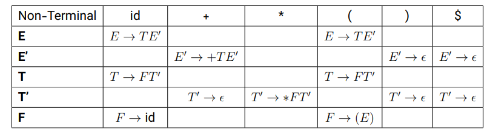
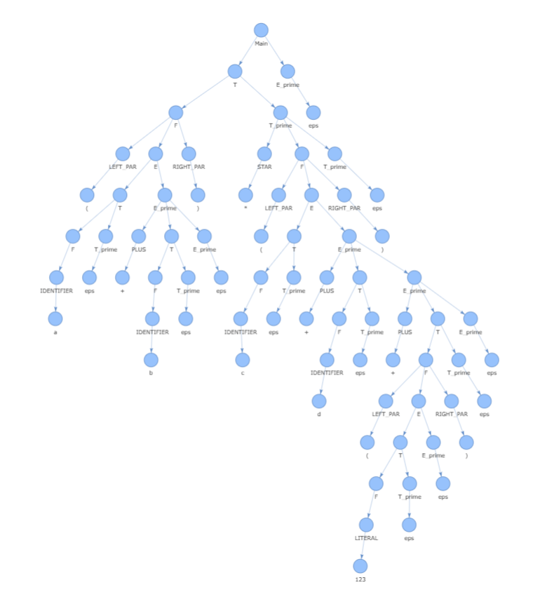

# TLA project

**This is project for my college and for TLA class**

This project is about creating small compiler that checks input and validate it by the grammer that get from user,
It also create tree for input that shows how we create and validate the the input, and at the end it says its is valid or no
by Lexical and Parse analyis.


## Table of contents
- [TLA project](#tla-project)
    - [Fetures](#fetures)
        - [Get input and store grammer](#1get-input-and-store-grammerget-input-and-store-grammer)
        - [Create First and Follow](#2create-first-and-follow)
        - [Create LL1 table](#3create-ll1-table)
        - [Create DPDA](#4create-dpda)
        - [Using Flask](#5using-flask)
    - [Acknowledgements](#acknowledgements)


---

## Fetures

- **Get input and store grammer**
- **Create First and Follow**
- **Create LL1 table**
- **Create DPDA**
- **Using Flask**
- **Show errors and mistakes in input**
- **Selecting nodes**

---

### 1.Get input and store grammer

In this part we get the `grammer` from user that its format looks like :
```text
START = E
NON_TERMINALS = E , E_prime , T , T_prime , F
TERMINALS = IDENTIFIER , LITERAL , PLUS , STAR , LEFT_PAR , RIGHT_PAR
E -> T E_prime
E_prime -> PLUS T E_prime | eps
T -> F T_prime
T_prime -> STAR F T_prime | eps
F -> LEFT_PAR E RIGHT_PAR | IDENTIFIER | LITERAL
IDENTIFIER -> [a-zA-Z_][a-zA-Z0-9_]*
LITERAL -> \d+(\.\d+)?
PLUS -> \+
STAR -> \*
LEFT_PAR -> \(
RIGHT_PAR -> \)
```
That includes `start-state`,`non-terminals`,`terminals`,`main-grammer` and `terminals-form` that get this data and
store them in **Grammer** class by extracting each data by using **GrammarReader** class.

> ℹ️ **Info**  
> These classes are in grammer folder and in grammer_reader.py file.

---

### 2.Create First and Follow

in this part we create First and Follow that is necesary for creating LL1 table.

**First Step**

we compute first by using `compute_follow` function, the first have form likes :

```text
FIRST(E) = { id, ( }

FIRST(E′) = { +, ε }

FIRST(T) = { id, ( }

FIRST(T′) = { *, ε }

FIRST(F) = { id, ( }
```
> 🗺️ **How we create it**
>
> 1. **Repeat** the following until no more changes occur:
> 2. For **each** grammar production `A → α`:
>    1. If `α` is a **terminal**, add `α` to `FIRST(α)`.
>    2. If `α` is a **non‑terminal** `B`, add `FIRST(B) - {ε}` to `FIRST(A)`.
>    3. If `α` is a **sequence** `X1 X2 … Xn`:
>       1. Add `FIRST(X1) - {ε}` to `FIRST(A)`.
>       2. If `FIRST(X1)` contains `ε`, move on to `X2`, then `X3`, …  
>       3. If **all** `Xi` can generate `ε`, add `ε` to `FIRST(A)`.


**Second Step**

we compue follow by using `compute_follow` function, the follow have form likes :

```text
FOLLOW(E) = { $, ) }

FOLLOW(E′) = { $, ) }

FOLLOW(T) = { +, $, ) }

FOLLOW(T′) = { +, $, ) }

FOLLOW(F) = { *, +, $, ) }
```

> 🗺️ **How we create it**
>
> 1. **Repeat** the following until no more changes occur:
> 2. **Initialize**:
>    1. Add `$` (end of input) to `FOLLOW(Start Symbol)`.
> 3. For **each** production `A → αBβ`:
>    1. Add `FIRST(β) - {ε}` to `FOLLOW(B)`.
>    2. If `β` is ε **or** `FIRST(β)` contains `ε`, add `FOLLOW(A)` to `FOLLOW(B)`.


> ℹ️ **Info**  
> These classes are in first_follow folder and in first_follow.py file.

---

### 3.Create LL1 table

after creating First and follow then by looking the data that we extract from first and follow functions we create 
LL1 table, that we looks likes :

  

> 🗺️ **How we create it**
>
> 1. **Initialize**:
>    1. an empty table `M`.
> 2. For **each** **nonterminal** `A` and each of its productions `α`:
>    1. If α is the epsilon production:
>        1. For every terminal `b` in **FOLLOW(A)**, set `M[A, b] = α`.
>    2. Else **(α ≠ ε)** :
>        1. Compute FIRST(α):
>           1. Scan the symbols of `α` left‑to‑right, unioning their **FIRST** sets **(excluding ε)** until you hit one that doesn’t derive `ε`.
>           2. If all symbols can derive `ε` , include `ε` in **FIRST(α)**.
>        2. For each terminal `a` in **FIRST(α) − {ε}**, set `M[A, a] = α`.
>        3. If **ε ∈ FIRST(α)**, then for every terminal `b` in **FOLLOW(A)**, set `M[A, b] = α`.
> 3. Return the filled table `M`.

> ℹ️ **Info**  
> These classes are in table folder and in ll1_table.py file.

---

### 4.Create DPDA

**1.First Step : Create Transitions**

after creating **LL1 Table** we create class **DPDA** that store transition and use `create_transitions` function that returns dictionary of transitions.


> 🗺️ **How we create transitions**
>
> 1. **Check** if the pair `(non_terminal, terminal)` exists in the **LL(1) parsing table**.
> 2. If an entry exists, **retrieve** its right‑hand side production as a list of symbols.
> 3. **Reverse** that list before pushing onto the stack:
>    1. We reverse so that the leftmost symbol ends up on top.  
>    2. _Example_: for `E → T E'`, the production list is `[T, E']`.  
>       - Without reversing, pushing in order would put `T` at the bottom and `E'` on top.  
>       - By reversing to `[E', T]`, we push `E'` first, then `T`, so `T` is on top.

**2.Second Step : Create Token From Input**

then after creating transition we use `create_token` that create token from the input that user gives to validate it.

✂️ **Purpose**  
Split an input string into tokens based on a user‑provided regular expression.

**3.Third Step : Validate And Create Parse Tree**

after tokenize the input we use `check_and_create_graph` that validate and create graph.

🛡️ **Purpose**  
Validate a tokenized input sequence against an LL(1) parsing table, drive the parsing stack, and build the corresponding parse graph.

---

### 5.Using Flask

for using NetworkX and Pyvis we needed to run it on html so we decided use Flask to get more feature beside run on browser , like :

- clicking and selecting
- showing problems

we could use `Graphviz` too but the output was png and pdf and we wanted on html so we didn't use it and use the `Networkx` and `Pyvis` library that the output looks
more beautiful in them :)

  

> 🔗 **Graph Visualization Notebook**  
> We built and rendered our Parse graph using this Colab workflow:  
> [📝 Open “Parse Graph Builder” on Colab](https://colab.research.google.com/drive/1upm3eO935KQQIA-2Kffg2hGu8387UnXp#scrollTo=49SXPOHWBNqN)

---

## Acknowledgements

A big thank‑you to Ilya jahed that helped me to create this project :

| Contributor    | Contribution                                              | Profile                                       |
|----------------|-----------------------------------------------------------|-----------------------------------------------|
| **Ilya Jahed** | Designed the LL(1) parsing algorithm<br>Generated grammar from user input | [GitHub › Ilyajahed](https://github.com/Ilyajahed) |

---


